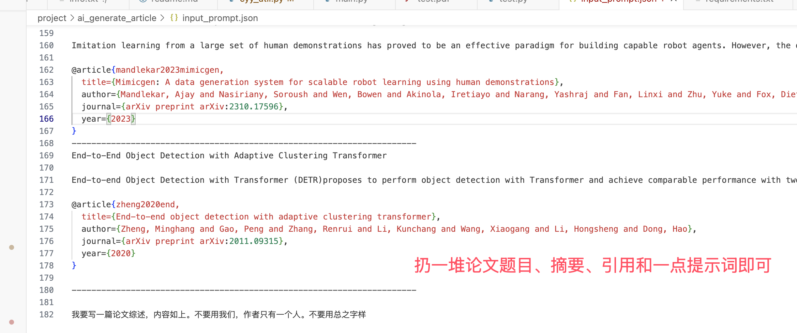

# 功能描述

文章目录生成
文章生成
生成文章
生成长篇文章、实验报告、latex论文生成overleaf格式论文
https://cn.overleaf.com/


# 环境搭建

```
conda create -n ai_generate_article python=3.10

conda activate ai_generate_article

pip install -r requirements.txt
```

# `运行`

git clone 项目

cd ai_generate_article

cyy_util.py文件填写deepseek的key，去deepseek官网获取。我放了一个key有10元额度，用完就需要自己申请调用了。

python main.py

# 引用

使用deepseek接口
https://api-docs.deepseek.com/zh-cn/quick_start/pricing

# 使用方法

写提示词到input_prompt.json中




执行python main.py，(deepseek有点弱，有时候报错，多执行两次就有结果了)

生成的main.tex文件放进overleaf空白项目里面，https://cn.overleaf.com/ 新建空白项目

点击左上角菜单，设置编译器版本为XeLaTex

点击编译即可得到pdf版本论文
